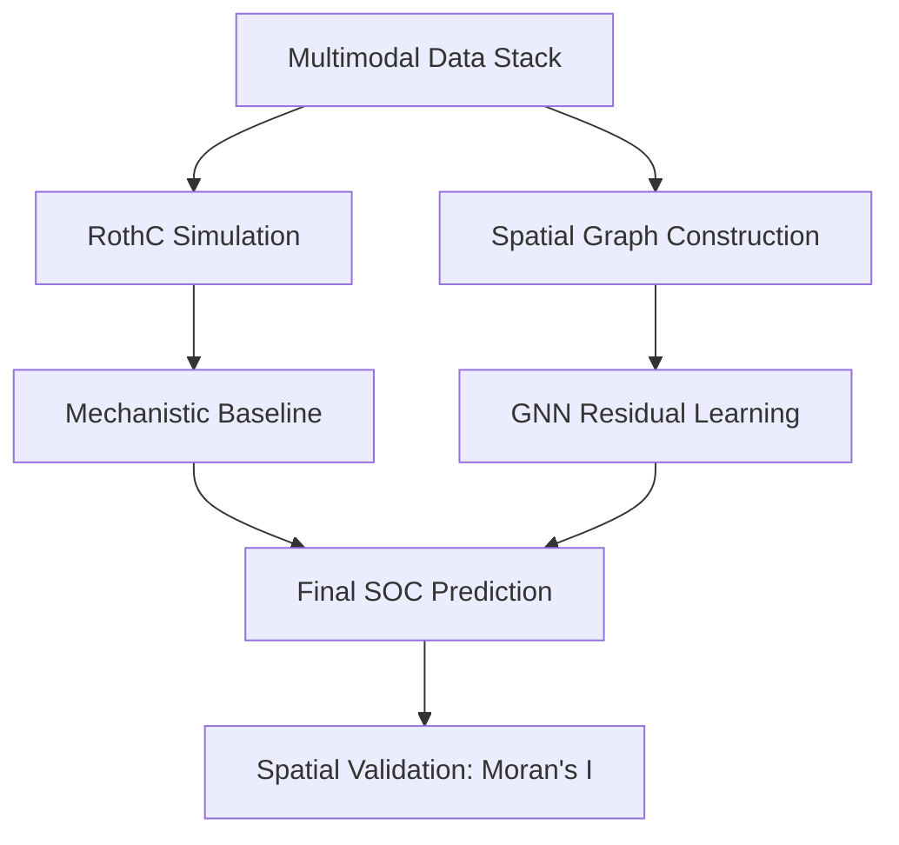

# Agrograph: Residual Graph Learning for Soil Organic Carbon Mapping

[](https://opensource.org/licenses/MIT)
[](https://www.python.org/downloads/)
[](https://pytorch-geometric.readthedocs.io/)

**Agrograph** is a physics-guided geometric deep learning framework designed to map Soil Organic Carbon (SOC) at high resolution (10m). By merging mechanistic process-based modeling (**RothC-26.3**) with **Multi-Scale Graph Neural Networks (GNNs)**, Agrograph captures both long-term biological turnover and local landscape heterogeneity.

---

## 🚀 Key Features

- **Hybrid Physics-ML Architecture**: Uses RothC to establish a scientifically grounded baseline and a GNN to learn spatial residual corrections.
- **Landscape-Aware GNN**: Utilizes **Multi-Scale GraphSAGE** with weighted spatial edges to model the lateral flux of carbon and water.
- **Geographic Encodings**: Implements **Sine-Cosine Positional Encodings** to overcome spatial non-stationarity in deep learning.
- **Multimodal Fusion**: Integrates Sentinel-2 spectral bands, TerraClimate variables, and high-resolution Topographic Indices (TPI, TRI, TWI).
- **Spatial Validation**: Features leakage-resistant **Blocked Spatial 5-Fold Cross-Validation** to ensure real-world generalizability.

---

## 📂 Project Structure

```text
AgroGraphAI/
├── data/                  # Geospatial data layers & sample points
│   ├── raw/               # Original SoilGrids & Sentinel-2 layers
│   └── processed/         # Normalized feature matrices & RothC outputs
├── manuscript/            # IEEE Research Paper (LaTeX)
│   ├── figures/           # Publication-ready plots
│   └── agroGraph.tex      # Main manuscript file
├── results/               # Training logs & model checkpoints
├── src/                   # Source code
│   ├── preprocessing/     # Sen2Cor & Terrain index generation
│   ├── simulation/        # RothC-26.3 engine & spin-up logic
│   ├── training/          # GNN & Baseline model training scripts
│   └── utils/             # Spatial graph & validation utilities
├── README.md              # Project overview
└── requirements.txt       # Dependency list
```

---

## 🛠️ How it Works

Agrograph operates on the principle that the **RothC** model provides a robust "first-order" approximation, while the **GNN** acts as a "second-order" spatial corrector.

### 1. The Residual Target
Instead of absolute values, the GNN predicts the residual error:
$$\Delta SOC = SOC_{observed} - SOC_{RothC}$$

### 2. Workflow Pipeline


---

## ⚡ Quick Start

### 1. Installation
```bash
git clone https://github.com/ayushsingh08-ds/AgroGraphAI.git
cd AgroGraphAI
pip install -r requirements.txt
```

### 2. Run RothC Spin-up
Initialize the steady-state carbon pools for your study area:
```bash
python src/simulation/run_rothc.py --mode spinup --site hesaraghatta
```

### 3. Train the Agrograph GNN
Train the residual graph model using spatial cross-validation:
```bash
python src/training/train_gnn.py --model agrograph --epochs 500 --spatial_cv
```

---

## 📊 Performance Benchmark

Agrograph achieves state-of-the-art results on the Hesaraghatta Grasslands dataset, significantly outperforming standalone physics models and standard machine learning.

| Model Family | Model | RMSE (Mg C/ha) | $R^2$ | Moran's I (p) |
| :--- | :--- | :---: | :---: | :---: |
| Mechanistic | RothC Baseline | 4.23 | 0.07 | 0.45 (0.01) |
| Empirical ML | Random Forest | 0.65 | 0.97 | 0.12 (0.05) |
| **Hybrid GNN** | **Agrograph** | **0.49** | **0.96** | **0.03 (0.14)** |

*Note: A Moran's I near 0 ($p > 0.05$) confirms that residuals are spatially random, proving the model has successfully captured the landscape logic.*

---

## 📜 Manuscript & Citation

The technical details of this framework are documented in our research paper:
**"Agrograph: Residual Graph Learning over Process-Based Soil Carbon Models for Spatial SOC Prediction"**

You can find the LaTeX source and figures in the `manuscript/` directory.

---

## 🤝 Contributors

- **Ayush Singh** (eng23ds0098@dsu.edu.in)
- **Sadgi Jaiswal** (eng23ds0082@dsu.edu.in)

Department of Computer Science & Engineering (Data Science), Dayananda Sagar University, Bangalore, India.